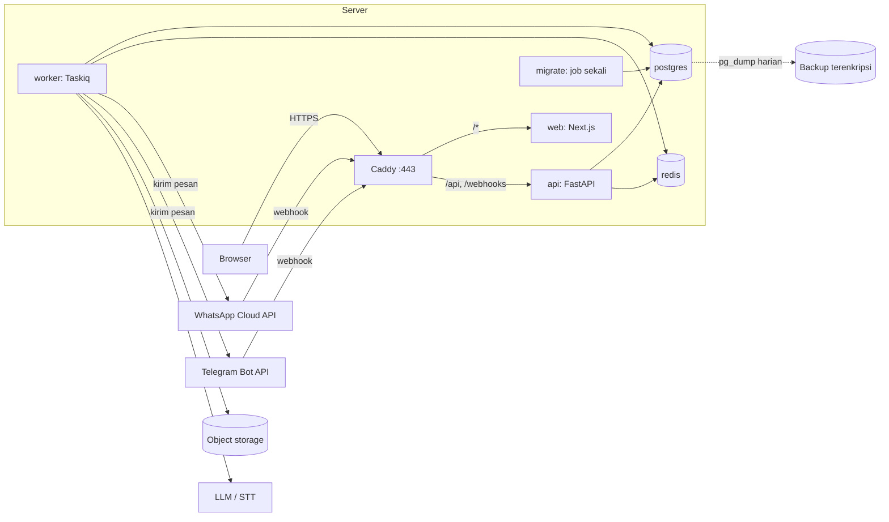
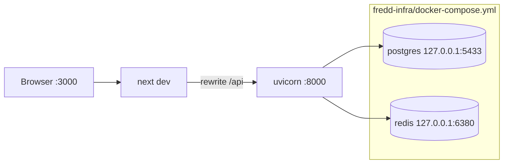

# Infrastructure Diagrams

## Produksi

```mermaid
flowchart LR
  user[Browser] -->|HTTPS| caddy
  meta[WhatsApp Cloud API] -->|webhook| caddy
  tg[Telegram Bot API] -->|webhook| caddy

  subgraph host[Server]
    caddy[Caddy :443]
    web[web: Next.js]
    api[api: FastAPI]
    worker[worker: Taskiq]
    migrate[migrate: job sekali]
    pg[(postgres)]
    redis[(redis)]
  end

  caddy -->|/*| web
  caddy -->|/api, /webhooks| api
  api --> pg
  api --> redis
  worker --> pg
  worker --> redis
  migrate --> pg
  worker -->|kirim pesan| meta
  worker -->|kirim pesan| tg
  worker --> s3[(Object storage)]
  worker --> llm[LLM / STT]
  pg -.->|pg_dump harian| backup[(Backup terenkripsi)]
```

## Development

```mermaid
flowchart LR
  dev[Browser :3000] --> next[next dev]
  next -->|rewrite /api| uvicorn[uvicorn :8000]
  uvicorn --> pg[(postgres 127.0.0.1:5433)]
  uvicorn --> redis[(redis 127.0.0.1:6380)]
  subgraph docker[fredd-infra/docker-compose.yml]
    pg
    redis
  end
```
